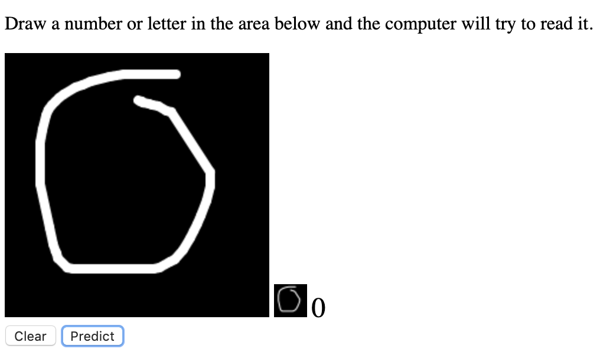

# Handwritten Digit Classifier

## ANN from Scratch

This is a neural network written from scratch in Javascript. A handwritten digit
classifier is the hello world of machine learning but I did not see any value in
creating one using a machine learning library. I decided the best way to really
understand what was going on was to try and make one from scratch.

### Lessons learned

I started with creating neural networks to approximate boolean operations such
as XOR and AND. When moving to larger problems like handwriting recognition, the
neural netowrk would always have the same output regardless of the input. I reduced
the learning rate as well as the number of epochs and got better results.

In my original design I tried to model the neurons directly but quickly ended up
down an abstraction rabbit hole that wasn't getting me any closer to solving the
problem. In re-evaluating my design I decided on modeling the network as an array
of matrices representing the weights which greatly simplified the logic of training
and prediction.
